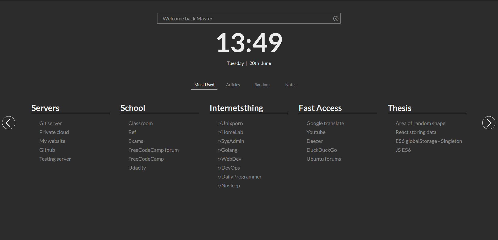
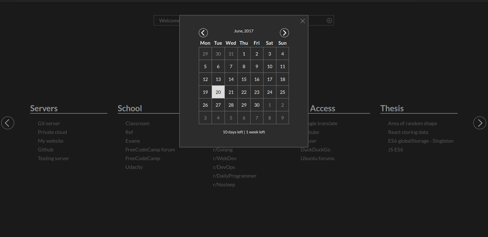
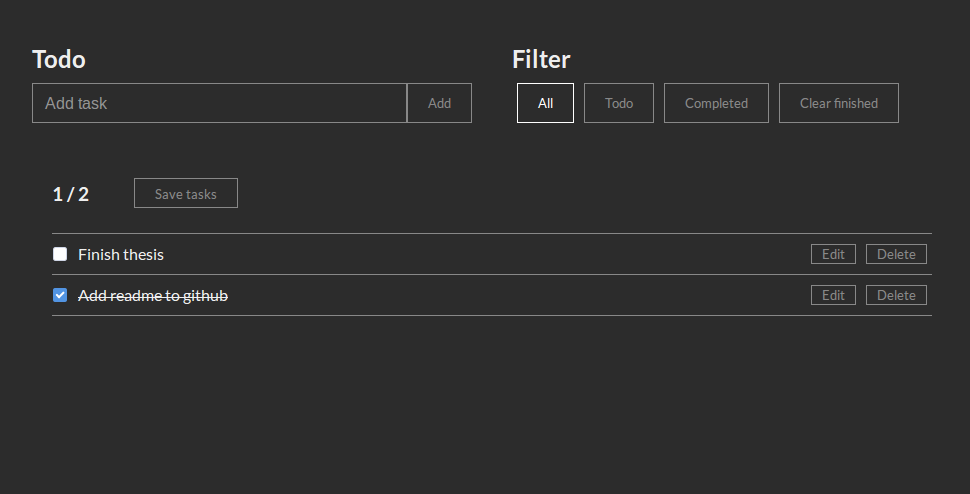
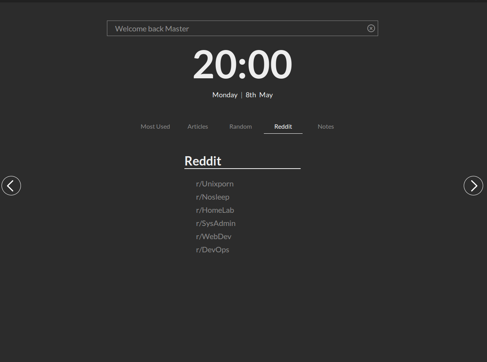

# Browser homepage

Custom browser homepage, for replacing default browser home page. It should work on any modern browser, just set `index.html` as your homepage and add your own links
to the index.html (see Adding links for more informations)

I had lots of unsorted links laying around and the current bookmarks extensions
are just horrible mess, so I developed my own idea. Hopefully someone will find this project useful.


## Live Example: [Browser Homepage](https://greatdanton.github.com/browser-homepage)

# Features

* Search (on Google or DuckDuckGo)
* Clock
* Calendar
* Countdown to custom date
* Todos built in
* Organizing links the way you want


# Screenshots

Main page


Integrated calendar


Integrated notes



# Adding links
Links should be added directly into `<div class="slides-container"` in index.html page. See below:

```html
<div class="slide" name="Reddit">
    <div class="part">
        <h1> Reddit </h1>

        <div class="links">
            <a href='https://www.reddit.com/r/unixporn/'> r/Unixporn </a>
            <a href='https://www.reddit.com/r/nosleep/'> r/Nosleep </a>
            <a href='https://www.reddit.com/r/homelab/'> r/HomeLab </a>
            <a href='https://www.reddit.com/r/sysadmin/'> r/SysAdmin </a>
            <a href='https://www.reddit.com/r/webdev/'> r/WebDev </a>
            <a href='https://www.reddit.com/r/devops/'> r/DevOps </a>
        </div>
    </div>
</div>
```

That's the output of above code, if I append it to my index.html




* Div with class slide is used for the name of the button (in line below the clock)
* h1 is used for displaying the title above the link group. One slide could have many
link groups


# Tips for usage
* Click on clock to display calendar and custom countdown
* Search input supports bangs (`!command`). Supported bangs:

    | command  | arguments | search on |
    | -------- | --------- | -------   |
    | !y       | search    | youtube   |
    | !books   | search    | bookzz    |
    | !wa      | /   | wolfram alpha |
    | !ebay    | /         | ebay      |
* Notes are automatically saved when close button (X) in top right corner is pressed. You can also save them manually via `save tasks` button


# Development:
The main goal of this project is to provide easy to use interface for sorting
your links (replacement for current bookmark managers). It was not meant to be all
around dashboard with integrations with various services. While such services
might be implemented in the future, the current goal of this project is to
fix the remaining bugs and clean ugly parts of the code first. The application
was meant to be a really simple one with everything inlined, however the code
got quickly out of hand.


## Code structure

```
├── components
│   ├── calendar.js
│   ├── clock.js
│   ├── countdown.js
│   ├── notes.js
│   ├── search-box.js
│   └── slides.js
├── css
│   ├── main_min.css
│   └── main.scss
```

* Components folder: contains every part/component of the browser homepage.
    * `calendar.js` -> contains code for displaying calendar when the clock is clicked
    * `clock.js` -> displays clock & date on the front page
    * `countdown.js` -> displays countdown under calendar. We can call it inside index.html or inside our own script via `countDown({'y': year, 'm': month, 'd': day}, msg)
    * `notes.js` -> contains code for managing todo tasks
    * `search-box.js` -> contains code for search input on the front page
    * `slides.js` -> code for sliding links part to left or right
* `index.html` -> your links go here, see template comment inside
* `main.scss` -> main scss file, (if you would like to change colors change them here) and compile it to main_min.css which is used by index.html


# TODO

* Calendar:
    - [ ] Add animations for month changes in calendar
    - [ ] Fast month/year selection (via dropdown) on month/year click

* Build system:
    - [ ] Use modern build system
        + concatenate all js files into one
        + auto browser reloading
        + scss compilation

* Notes:
    - [ ] Deleting task does not work from time to time

* Load links via JSON:
    - [ ] Loading links via JSON file would simplify adding and managing
    links/bookmarks, as well as the actual development process.

# License
See License file